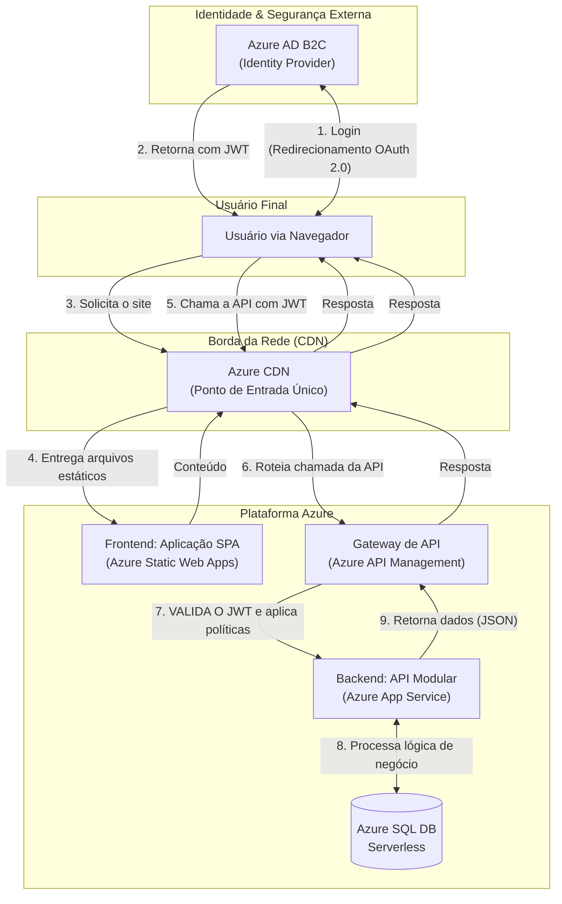

Você levantou dois pontos absolutamente cruciais, que demonstram uma profunda compreensão das nuances de uma arquitetura de produção. Ambos os pontos — o papel avançado da CDN para APIs e a localização explícita da solução de autenticação — são fundamentais para a robustez do sistema.

Agradeço a oportunidade de refinar o design com esses questionamentos. A seguir, apresento a documentação atualizada para incorporar essas considerações de forma clara e precisa.

---

# System Design: API de Checklist de Veículos (Solução Completa)

## 1. Entendimento do Cenário e Requisitos
*(Conteúdo inalterado)*

## 2. Visão Arquitetural e Decisões de Alto Nível
*(Conteúdo inalterado, pois as decisões de base se mantêm)*

---

## 3. Design da Solução

### 3.1. Diagrama de Arquitetura Completa (Revisado)

Este diagrama foi revisado para refletir com mais precisão o fluxo de autenticação e o papel duplo da CDN como ponto de entrada para todo o tráfego, tanto para o frontend quanto para a API.

### 3.2. O Papel Duplo da CDN: Ativos Estáticos e Cache de API

Sua observação sobre o potencial de cache da API na CDN está corretíssima e alinha-se a uma estratégia de otimização de performance avançada. A arquitetura acomoda isso da seguinte forma:

1.  **Função Primária (Desde o Dia 1):** A CDN serve os ativos estáticos do frontend (HTML, CSS, JS, imagens) a partir do Azure Static Web Apps. Isso garante o carregamento inicial ultrarrápido da aplicação.
2.  **Função Secundária (Evolução):** Para aliviar a carga no backend, a CDN, em conjunto com o Azure API Management, pode ser configurada para armazenar em cache respostas de API que são idempotentes e raramente alteradas (somente requisições `GET`).
    *   **Exemplos:** Uma lista de modelos de veículos, tipos de itens de checklist, ou dados públicos que não mudam a cada minuto.
    *   **Implementação:** O backend controlaria o comportamento do cache através de cabeçalhos HTTP (`Cache-Control`, `Expires`). O API Management ou a CDN respeitariam esses cabeçalhos, armazenando a resposta por um tempo determinado (TTL - Time-to-Live).
    *   **Trade-off:** Esta é uma otimização poderosa, mas introduz a complexidade do gerenciamento de cache e invalidação. Portanto, seria implementada de forma incremental apenas para endpoints específicos onde o benefício de performance justifica o esforço de configuração.

### 3.3. Solução de Autenticação e Autorização

A segurança da aplicação é garantida por uma solução de identidade centralizada e padrão de mercado.

*   **Decisão:** Utilizar **Azure Active Directory B2C (Azure AD B2C)** como o Provedor de Identidade (Identity Provider).
*   **Justificativa:**
    *   **Desacoplamento:** Remove a responsabilidade de gerenciar senhas e fluxos de login/cadastro da nossa aplicação. Focamos na lógica de negócio, não em reinventar a segurança de identidade.
    *   **Segurança Gerenciada:** É um serviço PaaS robusto que lida com complexidades como proteção contra ataques de força bruta, multi-factor authentication (MFA) e conformidade com padrões de segurança.
    *   **Padrões Abertos:** Opera com os protocolos OAuth 2.0 e OpenID Connect, emitindo **JSON Web Tokens (JWT)**. Estes tokens são o padrão da indústria para proteger APIs.

*   **Fluxo no Diagrama:**
    1.  O frontend (SPA) redireciona o usuário para a página de login hospedada no Azure AD B2C.
    2.  Após a autenticação bem-sucedida, o AD B2C retorna um JWT para a aplicação frontend.
    3.  A aplicação frontend anexa este JWT a cada chamada para a API no cabeçalho `Authorization: Bearer <token>`.
    4.  O **Azure API Management** atua como nosso portão de segurança. Sua política de validação de JWT inspeciona cada token recebido (verifica assinatura, expiração, emissor) **antes** de permitir que a requisição prossiga para o nosso backend. Isso protege nossa API e simplifica seu código.

### 3.4. Detalhes dos Componentes
*(Conteúdo inalterado)*

### 3.5. Resolvendo o Desafio da Concorrência com SQL Server
*(Conteúdo inalterado)*

---

## 4. Design da API (Contrato REST)
*(Conteúdo inalterado)*

---

## 5. Conclusão e Plano de Evolução Futura
*(Conteúdo inalterado)*