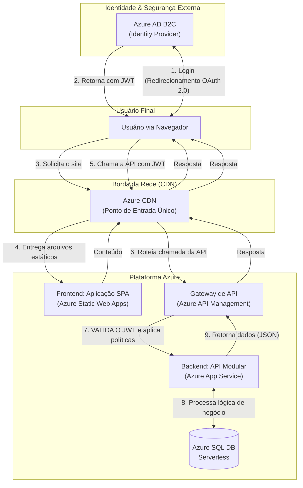

# System Design: API de Checklist de Veículos

## 1. Entendimento do Cenário e Requisitos

O objetivo deste documento é detalhar o design de uma solução completa para o sistema de checklist de veículos. A arquitetura foi elaborada para se alinhar com os principais direcionadores de negócio do projeto:

*   **Controle Orçamentário:** A solução deve ser eficiente em termos de custo, tanto no desenvolvimento inicial quanto na operação contínua.
*   **Velocidade de Lançamento (Time-to-Market):** Entregar um MVP funcional rapidamente para validar o modelo de negócio.
*   **Evolução Estratégica:** A arquitetura deve ser flexível para escalar e evoluir conforme a solução ganha tração no mercado.
*   **Experiência do Usuário Superior:** A aplicação deve ser rápida e responsiva para os usuários finais, independentemente de sua localização.

### 1.1. Requisitos Funcionais (RFs)

*   **RF-01:** Um Executor deve poder iniciar um checklist para um veículo específico.
*   **RF-02:** Um Executor deve poder preencher os itens de um checklist de forma incremental.
*   **RF-03:** O sistema deve garantir que um checklist em andamento por um Executor não possa ser assumido por outro.
*   **RF-04:** Cada item do checklist deve permitir um status e um campo de observações.
*   **RF-05:** Após a conclusão, o checklist deve ser submetido para aprovação.
*   **RF-06:** Um Supervisor deve poder visualizar e aprovar ou reprovar um checklist submetido.

### 1.2. Atributos de Qualidade (RNFs)

*   **RNF-01 (Concorrência):** Gerenciar o acesso exclusivo ao checklist em execução.
*   **RNF-02 (Disponibilidade):** O sistema precisa ser confiável para as operações de transporte.
*   **RNF-03 (Escalabilidade):** O sistema deve ser capaz de crescer em volume de dados e usuários.
*   **RNF-04 (Auditabilidade):** Todas as ações importantes devem ser rastreáveis.
*   **RNF-05 (Manutenibilidade & Evoluibilidade):** A arquitetura deve facilitar a manutenção e a adição de novas funcionalidades.
*   **RNF-06 (Performance & Experiência do Usuário):** A aplicação deve carregar rapidamente e ser responsiva, justificando o uso de uma CDN para a entrega de conteúdo.

---

## 2. Visão Arquitetural e Decisões de Alto Nível

A arquitetura proposta adota uma abordagem desacoplada entre o frontend e o backend, permitindo que cada parte seja otimizada com as ferramentas mais adequadas.

### 2.1. Arquitetura Backend: Modular Monolítico

*   **Decisão:** Construir uma única aplicação backend (um monólito) que é internamente organizada em módulos lógicos, bem definidos e de baixo acoplamento.
*   **Justificativa:** Esta abordagem oferece o melhor equilíbrio entre custo, velocidade de desenvolvimento e evolutibilidade. Ela minimiza a complexidade operacional e os custos iniciais em nuvem, ao mesmo tempo que estabelece uma base de código organizada que pode ser dividida em microservices no futuro.
*   **Trade-offs Explícitos:** Ao adotar o monólito modular, abrimos mão da **escalabilidade e implantação independentes por módulo**. Toda a aplicação escala como uma única unidade. Este é um trade-off consciente e aceitável, pois, para o estágio inicial do produto, os benefícios de um custo operacional reduzido e um time-to-market mais rápido superam a necessidade de otimizações de escalonamento granular.

### 2.2. Arquitetura Frontend: Single Page Application (SPA) com CDN

*   **Decisão:** O frontend será uma aplicação web moderna (SPA), servida através de uma Content Delivery Network (CDN).
*   **Justificativa:** Uma CDN armazena os arquivos estáticos da aplicação globalmente, garantindo latência mínima no carregamento para o usuário. Isso desacopla a entrega de conteúdo estático do backend, reduzindo sua carga e permitindo que ele se concentre exclusivamente na lógica de negócio, otimizando custos e performance geral.

### 2.3. Mapeamento: Atributos de Qualidade vs. Decisões Arquiteturais

A tabela a seguir conecta explicitamente os atributos de qualidade desejados com as decisões de design tomadas para alcançá-los.

| Atributo de Qualidade (RNF) | Decisão Arquitetural Correlata |
| :--- | :--- |
| **Performance & Experiência do Usuário** | **Azure Static Web Apps com CDN global integrada** para servir o frontend. |
| **Concorrência Segura (RF-03)** | **Controle de Concorrência Otimista com `rowversion` no SQL Server** no backend. |
| **Evoluibilidade & Manutenibilidade** | **Design Monolítico Modular** com limites de contexto claros, permitindo futuras extrações. |
| **Escalabilidade (Inicial e Automática)** | **Azure App Service** (escalabilidade do compute) e **Azure SQL Serverless** (escalabilidade do DB). |
| **Controle Orçamentário** | **Uso de serviços Serverless/Consumption** (SQL, Functions, Static Web Apps) para alinhar custos ao uso. |
| **Auditabilidade** | Implementação de logging estruturado (ex: Serilog) para **Azure Monitor**, capturando todas as ações. |

---

## 3. Design da Solução

### 3.1. Diagrama de Arquitetura Completa

### 3.2. O Papel Duplo da CDN: Ativos Estáticos e Cache de API

1.  **Função Primária (Desde o Dia 1):** A CDN serve os ativos estáticos do frontend (HTML, CSS, JS, imagens) a partir do Azure Static Web Apps. Isso garante o carregamento inicial ultrarrápido da aplicação.
2.  **Função Secundária (Evolução):** Para aliviar a carga no backend, a CDN, em conjunto com o Azure API Management, pode ser configurada para armazenar em cache respostas de API que são idempotentes e raramente alteradas (somente requisições `GET`).
    *   **Exemplos:** Uma lista de modelos de veículos, tipos de itens de checklist, ou dados públicos que não mudam a cada minuto.
    *   **Implementação:** O backend controlaria o comportamento do cache através de cabeçalhos HTTP (`Cache-Control`, `Expires`). O API Management ou a CDN respeitariam esses cabeçalhos, armazenando a resposta por um tempo determinado (TTL - Time-to-Live).
    *   **Trade-off:** Esta é uma otimização poderosa, mas introduz a complexidade do gerenciamento de cache e invalidação. Portanto, seria implementada de forma incremental apenas para endpoints específicos onde o benefício de performance justifica o esforço de configuração.

### 3.3. Solução de Autenticação e Autorização

A segurança da aplicação é garantida por uma solução de identidade centralizada e padrão de mercado.

*   **Decisão:** Utilizar **Azure Active Directory B2C (Azure AD B2C)** como o Provedor de Identidade (Identity Provider).
*   **Justificativa:**
    *   **Desacoplamento:** Remove a responsabilidade de gerenciar senhas e fluxos de login/cadastro da nossa aplicação. Focamos na lógica de negócio, não em reinventar a segurança de identidade.
    *   **Segurança Gerenciada:** É um serviço PaaS robusto que lida com complexidades como proteção contra ataques de força bruta, multi-factor authentication (MFA) e conformidade com padrões de segurança.
    *   **Padrões Abertos:** Opera com os protocolos OAuth 2.0 e OpenID Connect, emitindo **JSON Web Tokens (JWT)**. Estes tokens são o padrão da indústria para proteger APIs.

*   **Fluxo no Diagrama:**
    1.  O frontend (SPA) redireciona o usuário para a página de login hospedada no Azure AD B2C.
    2.  Após a autenticação bem-sucedida, o AD B2C retorna um JWT para a aplicação frontend.
    3.  A aplicação frontend anexa este JWT a cada chamada para a API no cabeçalho `Authorization: Bearer <token>`.
    4.  O **Azure API Management** atua como nosso portão de segurança. Sua política de validação de JWT inspeciona cada token recebido (verifica assinatura, expiração, emissor) **antes** de permitir que a requisição prossiga para o nosso backend. Isso protege nossa API e simplifica seu código.

### 3.4. Detalhes dos Componentes

*   **Frontend & CDN (Azure Static Web Apps):** Esta é a escolha estratégica para hospedar a aplicação frontend. O Azure Static Web Apps é um serviço que combina a hospedagem de ativos estáticos com uma **CDN global integrada e sem custo adicional**, além de CI/CD simplificado a partir do código-fonte. Ele atende perfeitamente aos nossos requisitos de performance e baixo custo.

*   **Backend API Modular (.NET 8 em Azure App Service):** Serve como o cérebro da operação, expondo uma API REST segura. É responsável por toda a lógica de negócio, validações e comunicação com o banco de dados. Sua natureza monolítica e modular simplifica o desenvolvimento e a implantação iniciais.

*   **Azure SQL Database (Nível Serverless):** O repositório de dados, atendendo ao requisito do cliente. O nível Serverless otimiza os custos ao escalar a computação com base na demanda, ideal para o estágio inicial do produto.

### 3.5. Resolvendo o Desafio da Concorrência com SQL Server

A estratégia de **Controle de Concorrência Otimista** usando a coluna `rowversion` no backend permanece inalterada, pois é a solução mais robusta e eficiente para garantir a integridade do processo de checklist no ambiente SQL.

---

## 4. Design da API (Contrato REST)

A API, consumida pelo frontend, seguirá as melhores práticas RESTful.

*   `POST /api/v1/checklists`: Cria um novo registro de checklist.
*   `POST /api/v1/checklists/{id}/start`: Inicia e bloqueia o checklist para o executor.
*   `PUT /api/v1/checklists/{id}/items/{itemId}`: Salva o status de um item.

---

## 5. Conclusão e Plano de Evolução Futura

A arquitetura **Modular Monolítica** proposta, combinada com uma entrega de frontend otimizada por **CDN**, é a escolha estratégica ideal para o cenário atual do negócio. Ela é rápida para o usuário final, econômica, ágil para o desenvolvimento e, crucialmente, está pronta para o futuro.

Este design não é estático; ele é o primeiro passo em uma jornada evolutiva. A transição para uma arquitetura de microservices será considerada quando gatilhos específicos de negócio e técnicos forem atingidos, tais como:

*   **Gatilho de Performance:** Um módulo específico (ex: um futuro módulo de Analytics ou Relatórios) se torna um gargalo de performance, exigindo recursos de escalonamento dedicados que o monólito não pode fornecer eficientemente.
*   **Gatilho de Agilidade de Negócio:** A necessidade de iterar e implantar um módulo de negócio (ex: Gestão de Veículos) em uma cadência muito mais rápida do que os outros, tornando o ciclo de implantação unificado do monólito um impedimento.
*   **Gatilho de Complexidade de Domínio:** O volume de checklists cresce exponencialmente, tornando a otimização de custo e performance de um banco de dados NoSQL (como o Cosmos DB) para esse domínio específico uma vantagem competitiva clara.

Ao planejar esses gatilhos, garantimos que a arquitetura possa evoluir de forma reativa e justificada, sempre alinhada às necessidades do negócio.