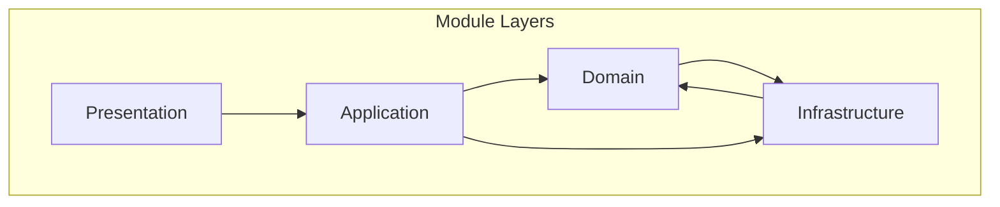

[Voltar ao README](README.md) | [Desafios](challenges.md)

## Arquitetura de Módulos

A arquitetura típica de um módulo em um Monolito Modular segue padrões como Clean Architecture ou Onion Architecture, com camadas claras:

- **Presentation/API**: Camada de entrada (controllers em .NET).
- **Application**: Lógica de aplicação, orquestração.
- **Domain**: Modelos de domínio, regras de negócio (DDD).
- **Infrastructure/Data**: Acesso a dados, repositórios.

Isso permite isolamento e testabilidade.

### Diagrama em Mermaid (Onion Architecture)

