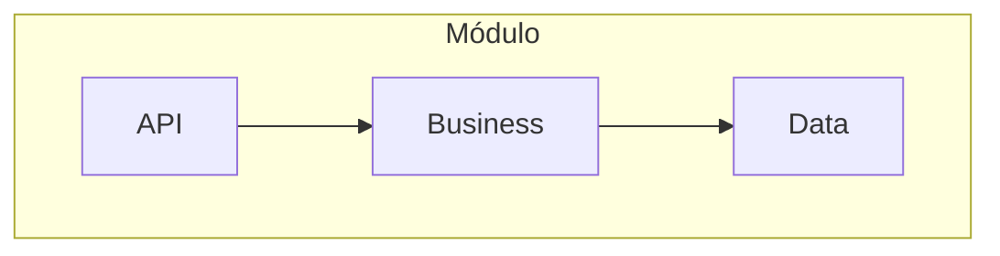
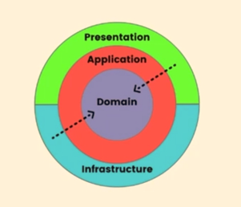
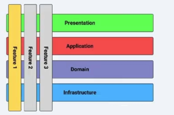

[Voltar ao README](README.md) | [Definição de Módulos >](defining-modules.md)

## Arquitetura Interna de um Módulo

Um módulo em um Monolito Modular não é apenas uma pasta com código; ele deve possuir uma arquitetura interna bem definida para garantir a separação de responsabilidades, a testabilidade e a manutenibilidade. Cada módulo pode ser visto como uma mini-aplicação com sua própria estrutura interna.

Os conceitos visuais apresentados na documentação original mostram três abordagens populares, as quais recriamos abaixo usando diagramas para melhor visualização no GitHub.

### 1. Arquitetura em Camadas (Layered Architecture)

A abordagem mais tradicional, onde as responsabilidades são separadas em camadas horizontais. É um ponto de partida simples, mas exige disciplina para evitar que as camadas se tornem excessivamente acopladas.

### 2. Arquitetura Limpa / Cebola (Clean/Onion Architecture)

Foca no domínio do negócio, com dependências apontando para o centro. Isso isola o coração da lógica de negócio de detalhes de infraestrutura.

### 3. Fatias Verticais (Vertical Slices)

Organiza o código por funcionalidade (feature), agrupando tudo o que é necessário para uma funcionalidade específica. Cada fatia vertical atravessa as camadas técnicas.

