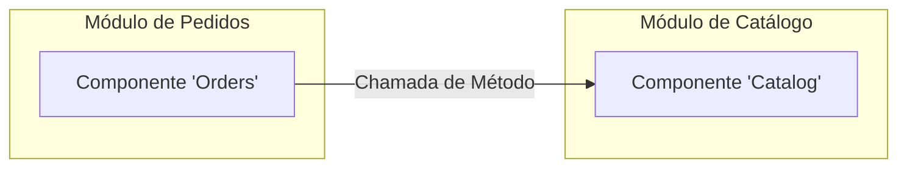

[Voltar ao README](README.md) | [Arquitetura Interna](module-architecture.md)

## Comunicação entre Módulos

Uma vez que os módulos estão definidos, é crucial estabelecer como eles se comunicarão de forma a manter o baixo acoplamento.

### Abordagem 1: Chamadas de Método Diretas (In-Memory)

A forma mais simples e performática de comunicação em um monolito é através de chamadas de método diretas. No entanto, elas devem ser feitas com disciplina.

